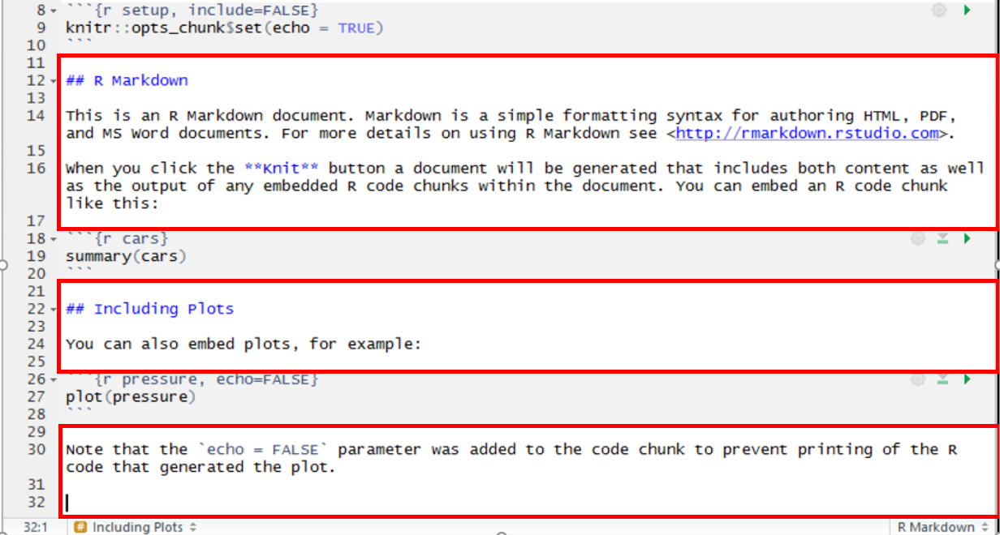
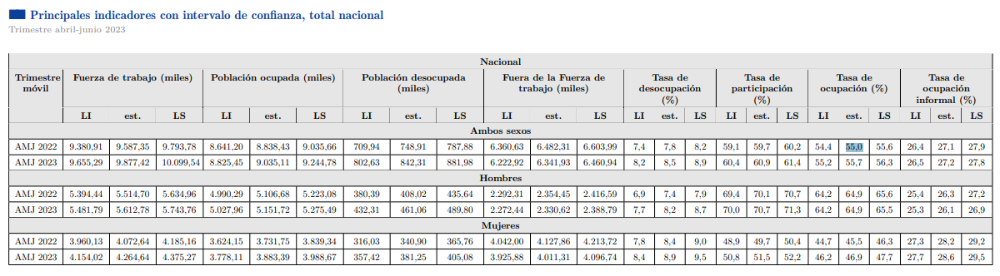

class: center, middle

.linea-superior[]
.linea-inferior[]


## Capacitación en R y herramientas de productividad - nivel intermedio

## Proyecto Ciencia de Datos

## Generación de reportería con R y Práctica!


```{r setup, include=FALSE}
options(htmltools.dir.version = TRUE)
knitr::opts_chunk$set(message = FALSE) 
```

```{r xaringan-themer, include=FALSE, warning=FALSE}
library(xaringanthemer)
library(xaringanExtra)
 
xaringanExtra::use_clipboard()
xaringanExtra::use_panelset()


# background-image: url("imagenes/burning_pc.gif")
# background-size: cover
# class: center, bottom, inverse

# ¿Por qué data.table?


```

---

background-image: url("imagenes/fondo2.PNG")
background-size: contain;
background-position: 100% 0%

# Contenidos de hoy

Algunas Posibilidades de reportería con R

- Rmarkdown
  - Repasemos como crear un reporte en **Html**
  - Una prueba con un **Word** de referencia

- Poniendo en práctica!!!

---

background-image: url("imagenes/fondo2.PNG")
background-size: contain;
background-position: 100% 0%

# R Markdown (recordando)

--

`R Markdown` .pur[provee de un marco] para generar documentos en el contexto del análisis de datos. En un único documento de `R Markdown` podemos:

--

.pull-left[
Guardar y ejecutar código.

Generar reportes de alta calidad que pueden ser compartidos fácilmente.

Los documentos creados con `R Markdown` son completamente reproducibles.

Generar presentaciones con **código** y **tablas**, **imágenes**, etc. (como las de este curso).
]

.pull-right[

]

---
background-image: url("imagenes/fondo2.PNG")
background-size: contain;
background-position: 100% 0%

# R Markdown (recordando)

--

## Cómo funciona

Los archivos de `R Markdown` en general tienen 3 partes:

--

(1). Un encabezado que permite configurar inicialmente el documento que vamos a escribir (**yaml**)


---

background-image: url("imagenes/fondo2.PNG")
background-size: contain;
background-position: 100% 0%

# R Markdown (recordando)


--

(2). "Pedazos de código" (o en inglés, ***chunk codes***).


---

background-image: url("imagenes/fondo2.PNG")
background-size: contain;
background-position: 100% 0%

# R Markdown (recordando)

--

(3). Los **cuerpos de texto** donde podemos hacer comentarios sin necesidad de usar "#"




---

background-image: url("imagenes/fondo2.PNG")
background-size: contain;
background-position: 100% 0%

# R Markdown (recordando)

--

Para generar el documento se puede utilizar el comando `render` o bien utilizar el botón `Knit` (Tejer).

--

`R Markdown` ofrece muchas posibilidades. Veremos mayormente cómo crear documentos en formato .pdf usando `R Markdown`, donde se puede incrustar código en $\LaTeX$.

--

Una de las principales **desventajas** de RMarkdown es que toma bastante **tiempo**⏰🕰️ hacer un documento la primera vez que se usa.

--

Y generalmente hay que **estudiar** un poco con google para que nuestros documentos resulten tal y como los imaginamos.

--

$\LaTeX$ es un sistema de composición de textos orientado a la creación de documentos científicos.

--

$\LaTeX$ es muy útil para escribir textos que incluyen notación matemática.

--

`R Markdown` cuenta con varias herramientas que nos permiten eximirnos un poco del conocimiento de $\LaTeX$ ⏩⏩⏩

---

background-image: url("imagenes/fondo2.PNG")
background-size: contain;
background-position: 100% 0%

# Ahora manos a la obra 👐 

--

.h2[Veamos un ejemplo en **Html**]

--

.h2[Veamos un ejemplo en **Word**] 

---

background-image: url("imagenes/fondo2.PNG")
background-size: contain;
background-position: 100% 0%

# Rmarkdown

## Configuración de los chunks

--

Los chunks tienen muchos argumentos que permiten moldear el output a lo que deseamos.

--

Existe un chunk llamado por defecto "setup".

--

.discussion[
{r setup, include=FALSE}
knitr::opts_chunk$set(echo = TRUE)
]

--

A través de este chunk es posible setear la configuración por defecto.

--

Esto lo hacemos cuando vamos a utilizar mucho alguna configuración, .pur[para no repetirla en cada chunk].

--

Los mismos argumentos se pueden utilizar para ajustar cualquier chunk.

---

background-image: url("imagenes/fondo2.PNG")
background-size: contain;
background-position: 100% 0%

# Rmarkdown

--

## Principales argumentos de los chunks

--

- include = FALSE/TRUE

--

- echo = FALSE/TRUE

--

- message = FALSE/TRUE

--

- warning = FALSE/TRUE

--

- error = FALSE/TRUE

--

**nota:** el shortcut para generar chunks en RMarkdown es .medium-par[.pur[Ctrl+Alt+i]]

--

Este shortcut realmente ahorra muuuchos pasos.

--

Revisemos esta guía de funcionalidades de [RMarkdown](https://rstudio.com/wp-content/uploads/2015/03/rmarkdown-reference.pdf?_ga=2.232725209.739649860.1603251660-1579346009.1585862093)


---

background-image: url("imagenes/fondo2.PNG")
background-size: contain;
background-position: 100% 0%

# Rmarkdown

--

## Algunos elementos a considerar al trabajar en Rmarkdown

--

`knitr()` (tejer) es una función. Y las funciones requieren que todo lo que se necesite se encuentre dentro de su ámbito. Entonces:

--

- La función setwd() no funciona dentro de RMarkdown.

- Las librerías que necesiten deben estar cargadas en el script de 
  Rmarkdown (**error habitual**).

- Tanto las bases de datos como las variables a utilizar deben estar
  llamadas dentro el script de Rmarkdown.

- Knitr() incluye la impresión de los resultados, por lo que no 
  es necesario usar print().

- No usar View() en RMarkdown, porque en el output no mostrará nada.

- Cada chunk puede tener o no tener un nombre. Si los deciden nombrar, 
  los nombres NO DEBEN REPETIRSE (**error habitual**).

--

---

background-image: url("imagenes/fondo2.PNG")
background-size: contain;
background-position: 100% 0%

# Poniendo en práctica - Paso 1

**Plan de trabajo:**

La idea es que comiencen a trabajar desde un documento en **Rmarkdown**, puede ser **HTMl** o **Word**, para al final de la clase poder ver los resultados en un reporte.

--

Se puede trabajar en pareja!

--

**Trabajaremos con datos de la ENE**


La idea es poder analizar las principales tasas que se publican con esta encuesta:
1. Tasa desocupación
1. Tasa ocupación
1. Tasa participación

--

**Paso 1**: Abrir todos los archivos .csv utilizando *purrr*, extraer nombres de los archivos así como el trimestre y el año para asignarlos como variables dentro de los dataframes.

--
 
**Tenemos 15 minutos!!!**


---

background-image: url("imagenes/fondo2.PNG")
background-size: contain;
background-position: 100% 0%

# Paso 1 - solución

Paso 1: Abrir todos los archivos .csv tenemos 10 minutos
--

1. listamos los archivos en la carpeta

```{r eval=FALSE}

files <- list.files("data/",full.names = T)

```

--

1.  extraemos el nombre de los archivos

```{r eval=FALSE}
nombres <- str_extract_all(files,"(2022|2023)-(\\d{2})-[a-zA-Z]{3}") %>% str_replace_all("-","_")

```
--

1. Abrimos y asignamos nombres anteponiendo la "a" para evitar las comillas en los nombres que comienzan con números

```{r eval=FALSE}

tictoc::tic()
ene <- map(files,read.csv2) %>% set_names(paste0("a",nombres))
tictoc::toc()


```

--

1.  extraemos año de los nombres de los archivos

```{r eval=FALSE}
agno <- str_extract_all(nombres,"2022|2023") %>% unlist()

```
--

1.  extraemos trimestres de los nombres

```{r eval=FALSE}
trimestre <- nombres %>% str_replace_all("-","_") %>% str_remove_all("2022_|2023_")
```

--

1.  generamos una variable con el año y una variable con el trimestre para cada archivo

```{r eval=FALSE}
ene <- map2(ene,agno,~mutate(.x,agno = .y))

ene <- map2(ene,trimestre,~mutate(.x,trimestre = .y))

```

---

background-image: url("imagenes/fondo2.PNG")
background-size: contain;
background-position: 100% 0%

# Poniendo en práctica - Paso 2

1. generemos una función que cree las variables de interés:

- Población en edad de trabaja **->** pet = edad >= 15
- Fuerza de trabajo = fdt **->** cae_especifico >= 1 & cae_especifico <= 9
- Ocupados **->** cae_especifico >= 1 & cae_especifico <= 7
- Desocupados **->** cae_especifico >= 8 & cae_especifico <= 9

**Tenemos 25 minutos!!**

--

Recomendación:

- Primero generar las variables de interés, luego aplicar la ponderación

- Es importante considerar que estas variables deben estar ponderabas por el factor de expansión para obtener los datos a nivel poblacional **(ocupados*fact_cal)**

- Para lograr lo anterior es necesaria una función que multiplique cualquier variable por el factor de expansión, utilizando lazy_eval

**Variable muestral -> función para ponderar -> variable ponderada**

---
background-image: url("imagenes/fondo2.PNG")
background-size: contain;
background-position: 100% 0%

# Paso 2 - solución

--

1. generemos una función que cree las variables de interés:

- Población en edad de trabaja **->** pet = edad >= 15
- Fuerza de trabajo = fdt **->** cae_especifico >= 1 & cae_especifico <= 9
- Ocupados **->** cae_especifico >= 1 & cae_especifico <= 7
- Desocupados **->** ae_especifico >= 8 & cae_especifico <= 9

```{r eval=FALSE}

f_variables_interes = function(datos){
  
  datos %>%
    mutate(pet = if_else(edad >= 15 ,1,0),
           fdt = if_else(cae_especifico >= 1 & cae_especifico <= 9, 1, 0), # fuerza de trabajo
           ocupados = if_else(cae_especifico >= 1 & cae_especifico <= 7, 1, 0), # persona ocupada
           desocupados = if_else(cae_especifico >= 8 & cae_especifico <= 9, 1, 0)) # personas desocupadas 
  
}

ene <- map(ene,f_variables_interes)

sum(ene$a2023_05_amj$fdt*ene$a2023_05_amj$fact_cal)

```

---
background-image: url("imagenes/fondo2.PNG")
background-size: contain;
background-position: 100% 0%

# Paso 2 - solución

Función para ponderación, calcular por factor de expansión


```{r eval=FALSE}

ponderar = function(var,fact){
  
# {{var}}*{{fact}}
  
}

```

--

Ahora necesitamos calcular la ponderación por todas nuestras variables de interés

seleccionamos solamente variables de interés 

```{r eval=FALSE}

variables = c("sexo","hogar","region","provincia","sector","fact_cal","agno","trimestre","fdt","ocupados","desocupados","pet","ocupados_exp","desocupados_exp",
  "pet_exp","fdt_exp","agno","trimestre")         

ene <- map(ene,~mutate(.x,across(c(ocupados,desocupados,pet,fdt), list(exp = ~ ponderar(.,fact_cal)))) %>% 
                select(all_of(variables)))

```

---

background-image: url("imagenes/fondo2.PNG")
background-size: contain;
background-position: 100% 0%

# Poniendo en práctica - Paso 3

Ahora calcularemos las principales tasas publicadas

Formulas:

1. Tasa desocupación
Corresponde al número de personas desocupadas, expresado como porcentaje de la fuerza
de trabajo (entendida como la sumatoria de personas ocupadas y desocupadas):

$TD = [DO/FDT]*100$

Donde:
𝐷𝑂 = Personas desocupadas
𝐹𝑇 = Fuerza de trabajo 

1. Tasa ocupación
Corresponde al número de personas ocupadas como porcentaje de la población en edad de trabajar (es decir, de quince años o más):

$TO = [O/PET]*100$

Donde:
𝐷𝑂 = Personas desocupadas
𝑃𝐸𝑇 = Población en edad de trabajar 

1. Tasa participación
Corresponde al número de personas en la fuerza de trabajo expresado como porcentaje de la población en edad de trabajar.

$TP = [FDT/PET]*100$

Donde,
𝐹𝑇 = Fuerza de trabajo
𝑃𝐸𝑇 = Población en edad de trabajar 

---

background-image: url("imagenes/fondo2.PNG")
background-size: contain;
background-position: 100% 0%

# Poniendo en práctica - Paso 3

- Calcule una tabla con las 3 tasas para todos los trimestres

- Calcule una tabla donde podamos ver la región con mayor tasa de desempleo por trimestre con **purrr**

- Calcule la misma tabla con **data.table** y compare resultados con alguno de los siguientes paquetes [aquí](https://www.jumpingrivers.com/blog/timing-in-r/)

* sería buena idea apilar las tablas de la lista con **dplyr::bind_rows()**

**Tenemos 25 minutos!!!**

--

¿Si se comparan los resultados con los valores publicados los valores son similares?

.center[]

---
background-image: url("imagenes/fondo2.PNG")
background-size: contain;
background-position: 100% 0%

# Poniendo en práctica - Paso 3 solución

- Calcule una tabla con las 3 tasas para todos los trimestres

```{r eval=FALSE}
ene_df = ene %>% bind_rows()

ene_df %>% 
  group_by(agno, trimestre) %>% 
  summarise(tasa_desocupacion = sum(desocupados_exp)/sum(pet_exp)*100,
            tasa_ocupacion = sum(ocupados_exp)/sum(pet_exp)*100,
            tasa_participacion = sum(fdt)/sum(pet_exp)*100) 

```


- Calcule una tabla donde podamos ver las regiones con mayor tasa de desempleo por trimestre con **purrr**
  
```{r eval=FALSE}

tictoc::tic()

ene_df %>% 
  group_by(agno, trimestre, region) %>% 
  summarise(tasa_desocupacion = sum(desocupados_exp)/sum(pet_exp)*100) %>% 
  group_by(trimestre) %>% 
  arrange(-tasa_desocupacion) %>% 
  slice(1)
  
tictoc::toc()
    
```

- Calcule la misma tabla con **data.table** y compare resultados

```{r eval=FALSE}
library(data.table)

ene_dt <- as.data.table(ene_df)

tictoc::tic()

ene_dt[,tasa_desocupacion := sum(desocupados_exp)/sum(pet_exp)*100,by=.(agno, trimestre, region)][
  ,.SD[which.max(tasa_desocupacion)],by=trimestre]

tictoc::toc()

```


---

class: center, middle

.linea-superior[]
.linea-inferior[]


## Capacitación en R y herramientas de productividad - nivel intermedio

## Proyecto Ciencia de Datos

## Generación de reportería con R
